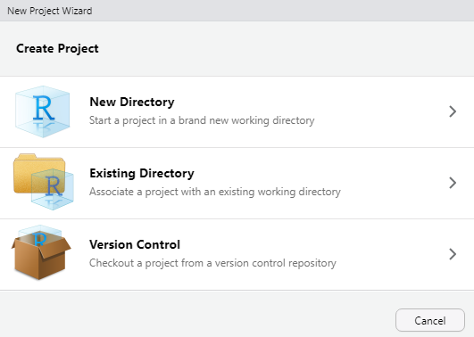
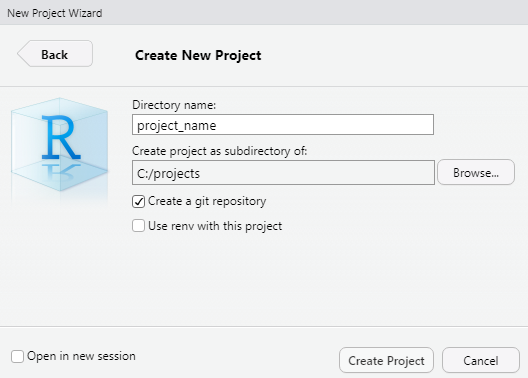
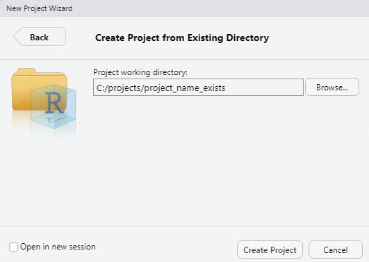

This is my R workflow when working on a project. It is written in the first
person because it is a post to instruct me what to do (I sometimes forget
what the next step is...).

## Prerequisites

This requires the following software to already be installed:

- R
- RStudio
- Git for Windows (well, just Git, but I typically use Windows, so...)

The installation and configuration of Git will be addressed in another blog post.
Once you set it up, it works.

## Setting up Git on Windows

I can use RStudio and the `usethis` package to setup Git after it is installed.
Just make sure `usethis` is installed in RStudio and then type 
`usethis::edit_git_config()` to edit your `gitconfig` file.

## Process

I typically use version control so if that is the case here, I need to create a 
repository for this in GitHub. I can create that repository first, or the create 
project process can create it if I am creating a new directory. Let's let RStudio 
create it (less work for me).

If the directory already exists, I will need to create the corresponding 
GitHub repository. Again, this can be done on GitHub or RStudio can do it and, 
again, let's let RStudio create it (it is still less work for me).

## Create a project in R

Create project in R using `File -> New Project...`. Select one of the directory
options, depending on whether I already have the directory created.



Go to creating in an [existing directory](#existing-directory)
### New Directory

If I am creating the folder, the most likely scenario, the select __`New Directory`__. 
I then need to select the project type, which is typically just a new project. 
Then complete the prompts in the dialog for the directory name, the location where 
this directory should be created, and then be sure to select 
__`Create a git repository`__ but __do not__ select the 
__`Use renv with this project`__. The first option makes sure we have source 
control set up for this project. The second option makes sure the packages are
isolated to this project, but we are going to need some additional configuration
before we create the Renv environment.



When you click the __`Create Project`__ button, the new project is created and
RStudio opens it. 

Now I can proceed to [setting up the Renv environment](#setting-up-the-renv-environment).

### Existing Directory

If the project folder already exists (typically because I received some data and
created a folder for it), then select __`Existing Directory`__. Use the 
__`Browse`__ button to select the existing folder. 



When you click the __`Create Project`__ button, the new project is created and
RStudio opens it. 

After the project is opened, I need to create the Git repository for
version control. To do this, enter __`usethis::use_git()`__ in the Console. This 
will create and initialize the local Git repository, allow you to commit the 
existing files, and restart RStudio to start using the Git repository.

Even though I have a Git repository, it is not synchronized with an online
repository in GitHub. To do that, we need to enter 
__`usethis::use_github(private=TRUE)`__ to create a private repository in GitHub
that is linked to this local repository. I prefer my projects to be private
since I am working with campus data. :) The repository in GitHub that is created
will have the same name as the project.

Now I can proceed to [setting up the Renv environment](#setting-up-the-renv-environment).

## Setting up the Renv environment

Before setting up Renv, I need to edit the project's .Renviron to set some 
variables used by Renv. In the Consle, execute 
__`usethis::edit_r_environ('project')`__ and enter the following data into this
file:

```
RENV_CONFIG_PAK_ENABLED = TRUE
RENV_CONFIG_MRAN_ENABLED = FALSE
```

If I need to ensure all the packages are local, then I need to add `RENV_CONFIG_CACHE_SYMLINKS = FALSE` to the .Renviron. 

After the .Renviron file is saved, restart the R session.

Now I can setup the Renv environment by executing the following code in the 
Console.

```
# You can change the date to whatever date you want for
# the checkpoint. You would typically use today's date.

today <- Sys.Date()
pak::repo_add(CRAN = glue::glue("MRAN@{today}"))
renv::init()

# If you are developing a package for use in Power BI,
# then you need to use Microsoft R Open 3.4.4 and 
# an MRAN date of 2018-04-01.
# pak::repo_add(CRAN = "MRAN@2018-04-01")
```

Now we are ready to code.

## Setting up the code environment

I need to install the necessary packages for my coding environment. There are 
a few that are common across all projects, and some are dependent on what I
am trying to do or what kind of data I have.

The base packages can be installed by executing the following commands in the
Console:

```
renv::install("tidyverse")
renv::install("data.table")
renv::install("dtplyr")
```

I probably also need the local package to access the campus database. I can 
install that with __`renv::install("haywood-ierg/haywoodcc")`__. 

#### Working with files

If I am working with files, I will need the `here` (`renv::install("here")`)
and `fs` (`renv::install("fs")`) packages. If using `here`, I will need to 
create a UUID by calling `uuid::UUIDgenerate()` and passing that as a 
parameter to `here::am_i(uuid = UUID_GOES_HERE)`. The `here` package allows me
to reference files based on the root of the project no matter where I 
reference them. For example, `here(path("data","data.csv"))` refers to 
`<project_dir>/data/data.csv` no matter where the source file lives within the
project.

#### Working with Excel files

If I am working with Excel files, I will need the `rio` package 
(`rev::install(rio)`). After install `rio`, execute `rio::install_formats()` in
the Console. 

## A collection of library calls

Here is the full collection of library calls. I will need to uncomment the 
ones I need for this project. I can delete the rest.

```
library(data.table)
library(dtplyr)
library(tidyverse) # This loads ggplot2, dplyr, tidyr, readr, purrr, tibble, stringr, and forcats 
library(dplyr, warn.conflicts=FALSE)
library(magrittr)
library(glue)

# Load this if working with CCDW_HIST database
library(haywoodcc)

# Load this if working with dates
# library(lubridate)

# To work with files on the file system, load these
# library(here)
# library(fs)
# Then you can load a CSV file called data.csv in the data folder by using the following
# data_csv <- read_csv(here(path("data","data.csv")))

# To work with Excel files, load this
# library(rio)
```
